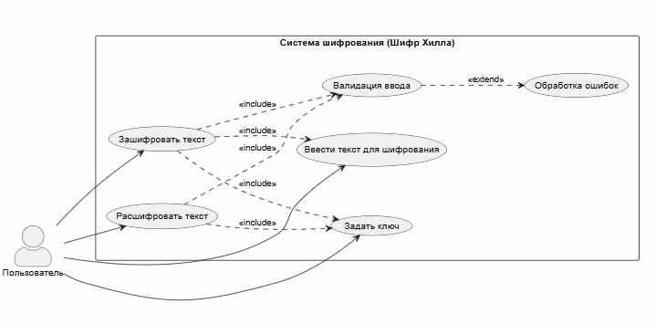

### Проект: Шифр Хилла
#### Разработчики: Резанцев Артемий, Трудова Анастасия
#### Вариант 9

**Предметная область** - Отладка и тестирование

### Диаграмма вариантов использования
``` m
@startuml
left to right direction
skinparam actorStyle awesome

actor "Пользователь" as User

rectangle "Система шифрования (Шифр Хилла)" {
   usecase "Ввести текст для шифрования" as UC1
   usecase "Задать ключ" as UC2
   usecase "Зашифровать текст" as UC3
   usecase "Расшифровать текст" as UC4
   usecase "Валидация ввода" as UC5
   usecase "Обработка ошибок" as UC6

   UC3 ..> UC1 : <<include>>
   UC3 ..> UC2 : <<include>>
   UC4 ..> UC2 : <<include>>
   UC3 ..> UC5 : <<include>>
   UC4 ..> UC5 : <<include>>
   UC5 ..> UC6 : <<extend>>
}

User --> UC1
User --> UC2
User --> UC3
User --> UC4

@enduml
```


### Тестовые сценарии

Документ **cipher_test_scenarios.docx** расположен в корневой папке проекта 

### Вывод
Проект успешно разработан и протестирован с помощью средств отладки Visual Studio