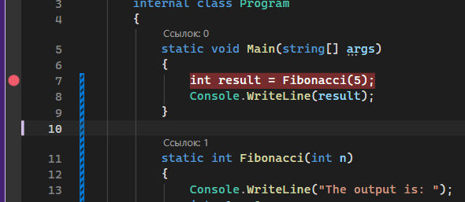
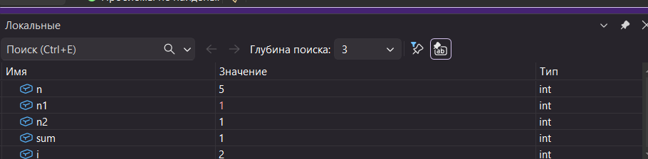
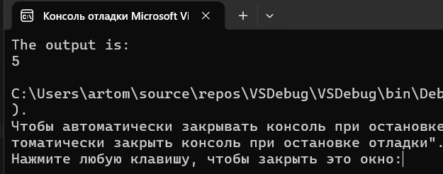

# VSDebug — Фибоначчи

Ветка: `Febonacci`  
Репозиторий: `VSDebug`

## Описание

Консольное приложение на C#, вычисляющее числа Фибоначчи. Использовалось как учебный стенд для изучения отладчика Microsoft Visual Studio.

Источник: [Use the Visual Studio debugger](https://learn.microsoft.com/ru-ru/training/modules/dotnet-debug-visual-studio/4-use-visual-studio-debugger)

## Что делает программа

- Вычисляет последовательность Фибоначчи рекурсивно
- Выводит результаты в консоль

## Использованные способы отладки Visual Studio

| Способ | Описание |
|---|---|
| **Точки останова (Breakpoints)** | Установлены для остановки выполнения на нужном шаге рекурсии |
| **Пошаговое выполнение (Step Over / F10)** | Проход по шагам без захода в рекурсивный вызов |
| **Заход в метод (Step Into / F11)** | Вход в рекурсивный вызов для отслеживания глубины |
| **Окно локальных переменных (Locals)** | Наблюдение за текущими значениями переменных на каждом уровне рекурсии |
| **Окно контрольных значений (Watch)** | Добавлены выражения для отслеживания промежуточных результатов |
| **Стек вызовов (Call Stack)** | Наблюдение за глубиной рекурсии через стек вызовов |

## Скриншоты

### Установка точки останова

### Значения переменных в отладчике

### Итоговый вывод
