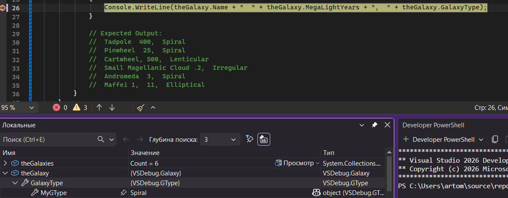
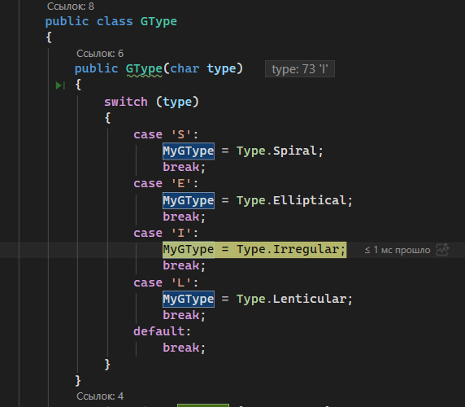
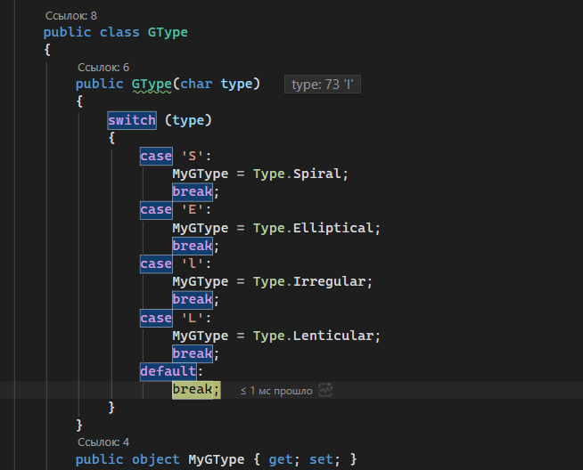
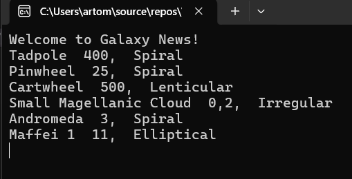

# VSDebug — Галактики

Ветка: `Galaxies`  
Репозиторий: `VSDebug`

## Описание

Консольное приложение на C#, демонстрирующее работу со списком объектов и перечислениями. Использовалось как учебный стенд для изучения отладчика Microsoft Visual Studio.

Источник: [Debugging for absolute beginners](https://learn.microsoft.com/ru-ru/visualstudio/debugger/debugging-absolute-beginners?view=vs-2022&tabs=csharp)

## Что делает программа

- Создаёт список объектов `Galaxy`, каждый из которых содержит название, расстояние в мегасветовых годах и тип галактики
- Тип галактики определяется через класс `GType` с перечислением (`Spiral`, `Elliptical`, `Irregular`, `Lenticular`) по символьному коду
- Выводит список галактик в консоль

## Использованные способы отладки Visual Studio

| Способ | Описание |
|---|---|
| **Точки останова (Breakpoints)** | Установлены в `IterateThroughList` для наблюдения за формированием списка |
| **Пошаговое выполнение (Step Over / F10)** | Проход по итерациям `foreach` |
| **Заход в метод (Step Into / F11)** | Вход в конструктор `GType` для отслеживания определения типа галактики |
| **Окно локальных переменных (Locals)** | Отслеживание полей объекта `theGalaxy` на каждой итерации |
| **Окно контрольных значений (Watch)** | Наблюдение за `theGalaxy.Name`, `theGalaxy.GalaxyType.MyGType` |
| **Подсказки при наведении (DataTips)** | Просмотр вложенных свойств объектов прямо в редакторе |
| **Стек вызовов (Call Stack)** | Просмотр цепочки вызовов при остановке внутри `GType` |

## Скриншоты

### Тип галактики MyGType в отладчике

### Изменение значения переменной в процессе отладки

### Ошибка в литере

### Правильный вывод после исправления
