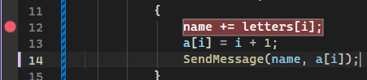
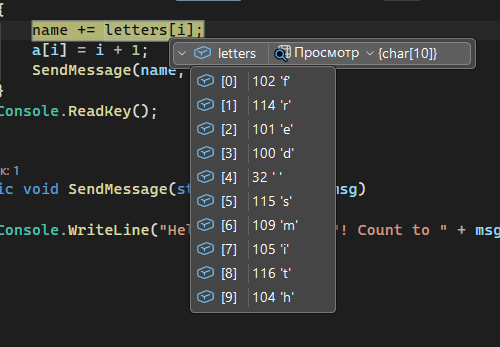
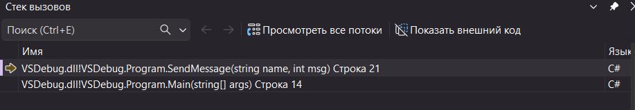

# VSDebug — Буквы

Ветка: `Letters`  
Репозиторий: `VSDebug`

## Описание

Консольное приложение на C#, демонстрирующее пошаговую сборку строки из массива символов и накопление счётчика. Использовалось как учебный стенд для изучения отладчика Microsoft Visual Studio.

[Источник](https://learn.microsoft.com/ru-ru/visualstudio/get-started/csharp/tutorial-debugger?toc=%2Fvisualstudio%2Fdebugger%2Ftoc.json&amp;view=vs-2022#create-a-project)

## Что делает программа

- Объявляет массив символов `letters`, из которых поэтапно собирается строка `name`
- На каждой итерации вызывается `SendMessage`, выводящий приветствие с текущим состоянием строки и значением счётчика

## Использованные способы отладки Visual Studio

| Способ | Описание |
|---|---|
| **Точки останова (Breakpoints)** | Установлены на вызов `SendMessage` и внутри цикла для пошагового наблюдения |
| **Пошаговое выполнение (Step Over / F10)** | Проход по итерациям цикла без захода внутрь метода |
| **Заход в метод (Step Into / F11)** | Вход в `SendMessage` для наблюдения за формированием строки вывода |
| **Окно локальных переменных (Locals)** | Отслеживание изменений `name`, `i`, `a[i]` на каждом шаге |
| **Окно контрольных значений (Watch)** | Добавлены выражения `name`, `letters[i]`, `a[i]` для наблюдения в реальном времени |
| **Подсказки при наведении (DataTips)** | Просмотр значений переменных непосредственно в редакторе кода |
| **Стек вызовов (Call Stack)** | Просмотр цепочки вызовов при остановке внутри `SendMessage` |

## Скриншоты

### Установка точки останова

### Значение массива letters в отладчике

### Стек вызовов
